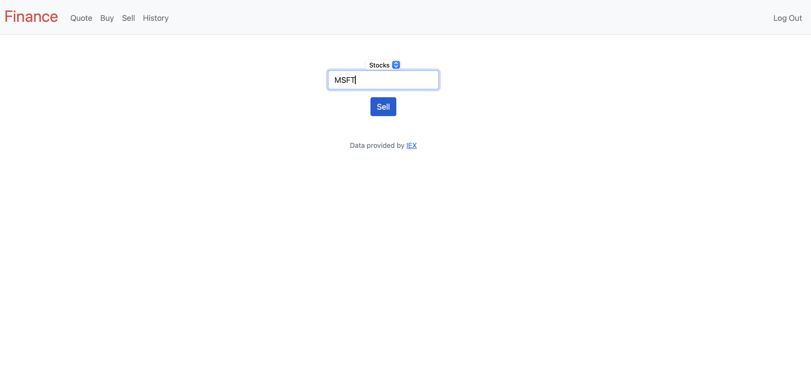

Stock Simulator

The Stock Simulator is a web application designed to help users practice stock trading and financial analysis without the risk of real-world money. The platform allows users to simulate buying and selling stocks in real-time, track their portfolio's performance, and learn about stock trading strategies. It provides an interactive environment for beginners and experienced traders alike to hone their skills.

Features

Real-Time Stock Data: Integration with the IEX Cloud API to fetch live stock prices and historical data.
Portfolio Management: Users can create a portfolio, track stock investments, and monitor overall portfolio performance.
Stock Trading: Simulate buying and selling stocks with virtual currency, allowing users to practice trading strategies.
Market Overview: Provides a live feed of stock market trends, top gainers, and losers.
Trading History: Keep track of all past trades and investment decisions.
User Profiles: Each user has a profile displaying their portfolio balance, stock history, and trading activity.
Tech Stack

Backend: Flask
Frontend: JavaScript, HTML, and CSS
Database: SQLite (or Firebase if updated)
APIs: IEX Cloud API for stock data
Deployment: Previously Hosted on Vercel

Future Actions

Add personalized stock recommendations based on user portfolio.
Implement additional trading features such as margin trading and short selling.
Improve the UI/UX for better user experience and responsiveness.
Migrate to Firebase for better authentication and real-time data handling.
Include news and analytics features to provide users with more insights on stock movements.
Introduce a leader board for users to compare their simulated portfolio performances.

Images

